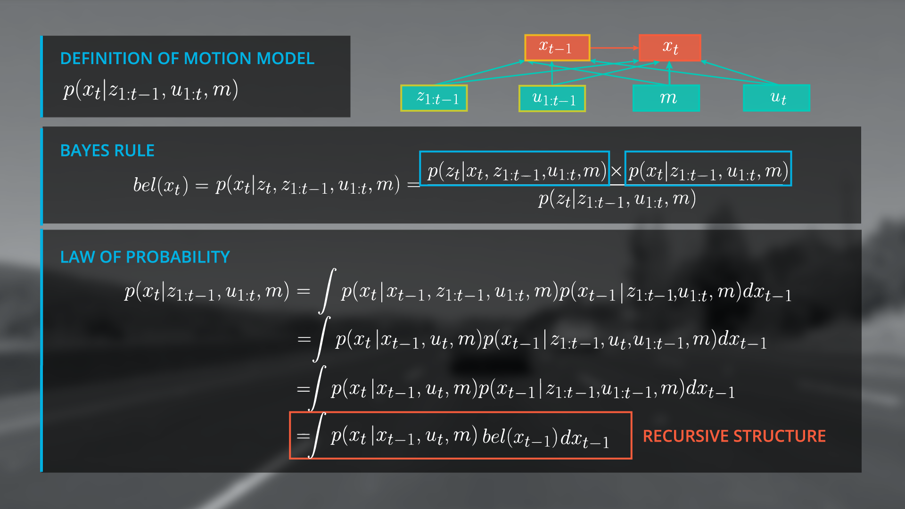
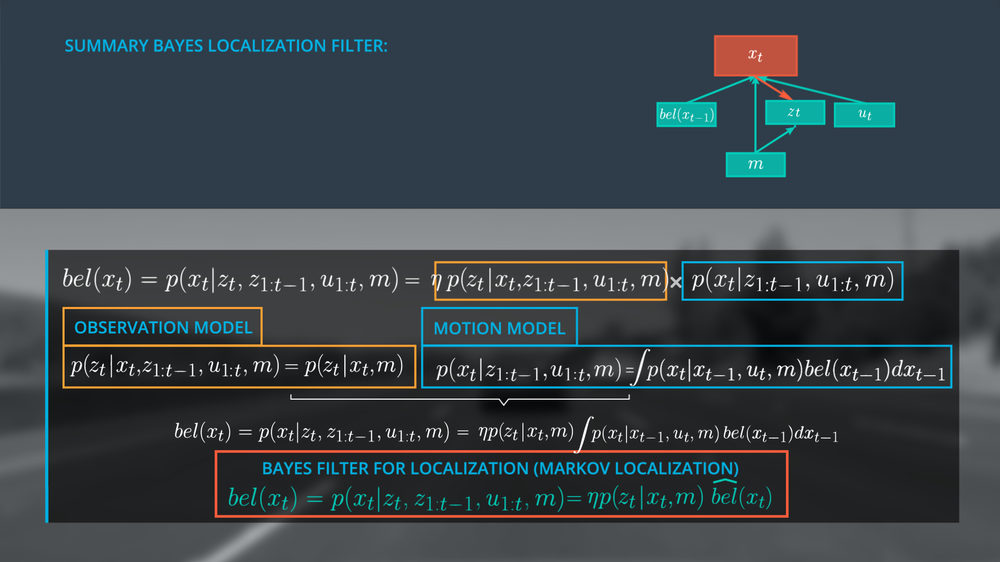
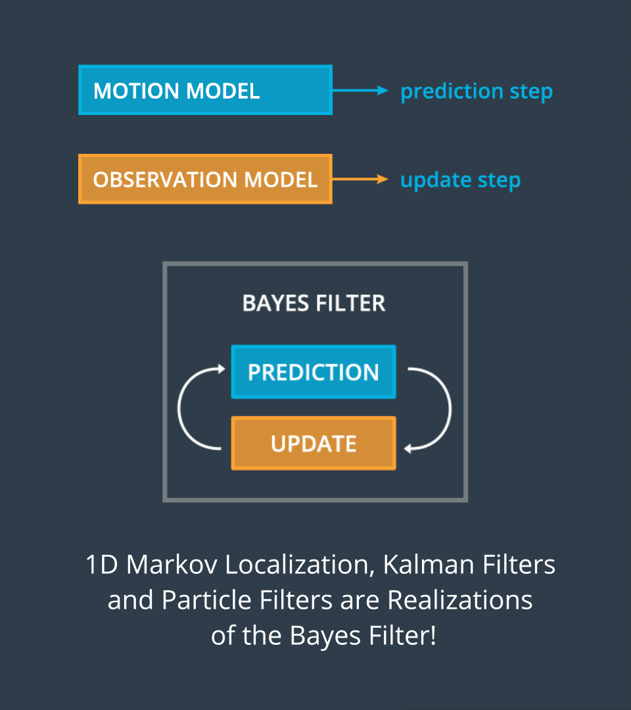
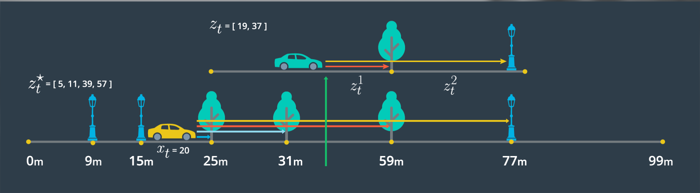

[TOC]
# Localization
Markov localization or Bayes Filter for localization is a generalized filter for localization and all other localization approaches are realizations of this approach.  
## Formal Definition of Variables  
$z_{1:t}$ represents the observation vector from time 0 to t(range measurements, bearing, images, etc.).  
$u_{1:t}$ represents the control vector from time 0 to t(yaw/pitch/roll rates and velocities).  
$m$       represents the map(grid maps, feature maps, landmarks).  
$x_t$     represents the pose(position(x, y) + orientation $\theta$)  

Given the map, the control elements of the car, and the observations, the definition of the posterior distribution for the state x at time t is:
$$ bel(x_t) = p(x_t | z_{1:t}, u_{1:t}, m) $$  

## Bayes' Rule  
Before we dive into deeper into Markov localization, we should review Bayes' Rule. This will serve as a refresher for those familiar with Bayesian methods and we provide some additional resources for those less familiar.  
Recall that Bayes's rule enables us to determine the conditional probability of a state given evidence $P(a|b)$ by relating it to the conditional probability of the evidence given the state $P(b|a)$ in the form of:  
$$ P(a) * P(b|a) = P(b) * P(a|b) $$  
which can be rearranged to:  
$$ P(a|b) = \frac{P(b|a) P(a)}{P(b)} $$  

**Bayesian Methods Resources**

+ [Sebastian Discusses Bayes Rule](https://classroom.udacity.com/nanodegrees/nd013/parts/30260907-68c1-4f24-b793-89c0c2a0ad32/modules/28233e55-d2e8-4071-8810-e83d96b5b092/lessons/3c8dae65-878d-4bee-8c83-70e39d3b96e0/concepts/487221690923?contentVersion=2.0.0&contentLocale=en-us)
+ [More Nayes Rule Content from Udacity](https://classroom.udacity.com/courses/st101/lessons/48703346/concepts/483698470923)  
+ [Bayes Rule with Ratios](https://betterexplained.com/articles/understanding-bayes-theorem-with-ratios/)  
+ [A Deep Dive into Bayesian Methods, for Programmers](http://greenteapress.com/wp/think-bayes/)  

## Bayes' Filter for Localization  
We can apply Bayes' Rule to vehicle localization by passing variables through Bayes' Rule for each time step, as our vehicle moves. This is known as a Bayes' Filter for Localization. In fact, many localization filters, including the gaussian filter are special cases of Bayes' Filter.  
Remember the general form for Bayes' Rule:  
$$ P(a|b) = \frac {P(b|a)P(a)}{P(b)} $$  
With respect to localization, these terms are:  

1. $P(location|observation)$: This is P(a|b), the **normalized** probability of a position given an observation(posterior).  
2. $P(observation|location)$: This is P(b|a), the probability of an observation given a position(likelihood).  
3. $P(location)$: This is P(a), the prior probability of a position.  
4. $P(observation)$: This is P(b), the total probability of an observation.  

Without going into detail yes, be aware that $P(location)$ is determined by the motion model. The probability returned by the motion model is the product of the transition model probablity(the probablity of moving from $x_{t-1}$ --> $x_t$ and the probablity of state $x_{t-1}$).  

Next steps to be done:  

1. Compute Bayes' Rule.  
2. Calcualte Bayes' posterior for localization.  
3. Initialize a prior belief state.  
4. Create a function to initialize a prior belief state given landmarks and assumptions.  

## How Much Data?  
We need to know how much size of data, in order to know more about the performance of localization. Assuming:  

+ With each fresh, LIDAR sends **100,000** data points/observations.  
+ Each observation contains **5 pieces** of data (point id, range, 2 angles and reflectivity).  
+ Each piece of data requires **4 bytes**.
+ Drive for **6 hours**.  
+ Lidar refreshes **10 times per second**.  

The result should be **432GB**:  
$$ 6 Hours \times \frac{3600 Seconds}{Hour} \times \frac{10 Cycles}{Second} \times \frac{100,000 Observations}{Cycle} \times \frac{5 Data pieces}{Observation} \times \frac{4 Bytes}{Data piece} $$  
We can say that the data volumn is too much big! So we have to find a solution to solve this issus.  In all, the two problems if we want to estimate $bel(x_t) = p(x_t | z_{1:t}, u_{1:t}, m)$ directly are:  

1. A LOT of data! (100s of GBs per update).  
2. Amount of data increases over time.  

This will not work for real-time localizer, because the real-time localizer should work at least 10Hz in a vehicle.  Actually for real-time localizer, the requirements should be:  

1. A little data to process(bytes per update).  
2. Amount of data remains constant.  

## Apply Bayes' Rule with Additional Conditions  
  

We aim to estimate state beliefs $bel(x_t)$ without the need to carry our entire observation history. We will accomplish this by manipulating our posterior $p(x_t | z_{1:t}, u_{1:t}, m)$, obtaining a recursive state estimator. For this work, we must demonstrate that our current belief $bel(x_t)$ can be expressed by the belief one step earlier $bel(x_{t-1})$, then use new data to update only the current belief. This recursive filter is known as the **Bayes Localization filter** or **Markov Localization**, and enables us to avoid carrying historical observation and motion data. We will achieve this recursive state estimator using Bayes' Rule, the Law of Total Probability and the Markov Assumption.  
  

We take the first step towards our recursive structure by splitting our observation vector $z_{1:t}$ into current observation $z_t$ and previous information $z_{1:t-1}$. The posterior can then be written as $p(x_t|z_t, z_{1:t-1}, u_{1:t}, m)$.  
  

Now we apply Bayes' Rule, with an additional chanllenge, the presence of multiple distributions on the right side(likelihood, prior, normalizing constant).  
$$ p(x_t|z_t, z_{1:t-1}, u_{1:t}, m) = \frac{p(z_t|x_t, z_{1:t-1}, u_{1:t}, m) p(x_t|z_{1:t-1}, u_{1:t}, m)}{p(z_t|z_{1:t-1}, u_{1:t}, m)} $$ 
  

To simplify the normalization part, we define the normalizer as $\eta$， so:  
$$ \eta = \frac{1}{p(z_t|z_{1:t-1}, u_{1:t}, m)} = \frac{1}{\sum_i{p(z\_t|x_t^{(i)},z_{1:t-1},u_{1:t},m)}p(x_t^{(i)}|z_{1:t-1},u_{1:t}, m)}$$  
The definition of motion model:  
$$p(x_t|z_{1:t-1}, u_{1:t}, m)$$  
The problem here is that we have no information where the car was before at time $t-1$. This means no information about the previous state $x_{t-1}$. 
In this case, the Law of Total Probability will help a LOT!  
$$ P(B) = \sum_{i=1}^{\infty}{P(B|A_i)P(A_i)} $$  
So, the motion model can be expressed as in the form of Law of Total Probability:  
$$ p(x_t|z_{1:t-1}, u_{1:t}, m) = \int {p(x_t|x_{t-1}, z_{1:t-1}, u_{1:t}, m)p(x_{t-1}|z_{1:t-1}, u_{1:t}, m)dx_{t-1}} $$  
## Markov Assumption for Motion Model  
There are two assumptions:  

1. Since we(hypothetically) known in which state the system is at time step t-1, the past observations $z_{1:t-1}$ and controls $u_{1:t-1}$ would not provide us additional information to estimate the posterior for $x_t$, because they were already used to estimate $x_{t-1}$. This means, we can simplify $p(x_t|x_{t-1}, z_{1:t-1}, u_{1:t-1}, m)$ to $p(x_t|x_{t-1}, u_t, m)$.  
2. Since $u_t$ is "in the future" with reference to $x_{t-1}$, $u_t$ does not tell us much about $x_{t-1}$. This means the term $p(x_{t-1}|z_{1:t-1}, u_{1:t}, m)$ can be simplified to $p(x_{t-1}|z_{1:t-1}, u_{1:t-1}, m)$.  

As a Formal explanation, a Markov process is one in which the conditional probability distributions of future states(ie the next state) is dependent only upon the current state and not on other preceding states. This can be expressed mathematically as:  
$$P(x_t|x_{t-1},...,x_{t-i}...,x_0) = P(x_t|x_{t-1})$$  
It is important to note that the current state may contain all information from preceding states. 

With Markov assumption, the motion model can be simplified as:   
$$p(x_t|z_{1:t-1}, u_{1:t}, m) = \int{p(x_t|x_{t-1}, u_t, m)p(x_{t-1}|z_{1:t-1}, u_{1:t-1}, m)dx_{t-1}}$$   

After applying the Markov assumption, the term $p(x_{t-1}|z_{1:t-1}, u_{1:t-1}, m)$ describes exactly the belief at $x_{t-1}$! This means we have achieved a very important step towards the final form of our recursive state estimator. Let's see why. If we rewrite the second term in our integral to split $z_{1:t-1}$ to $z_{t-1}, z_{1:t-2}$, we arrive at a function that is exactly the belief form of the previous time step, namely $bel(x_{t-1})$.  
  

Now we can rewrite the motion model as the belief of $x_{t-1}$  
$$ p(x_t|z_{1:t-1}, u_{1:t}, m) = \int{p(x_t|x_{t-1}, u_t, m)bel(x_{t-1})dx_{t-1}}$$  
  

The amazing thing is that we have a recursive update formula and can now use the estimated state from the previous time step to predict the current state at t. This is a critical step in a recursive Bayesian filter because it renders us independent from the entire observation and control history. So in the graph structure, we will replace the previous state terms (highlighted) with our belief of the   

Finally, we replace the integral by a sum over all $x_i$ because we have discrete localization scenario in this case. The process of predicting $x_t$ with a previous beliefs $x_{t-1}$ and the transition model is the technically a convolution. If you take a look at the formula again, it is essential that the belief at $x_t=0$ is initialized with a meaningful assumption. It depends on the localization scenario how you set the belief or in other words, how you initialize your filter. For example, you can use GPS to get a coarse estimate of your locaiton.   


## Implementation of State Estimator  
### Determine Probabilities  
To implement these models, we need a function to which we can pass model parameters/values and return a probability. Fortunately, we can use a normalized probability dense function(PDF).   
```c++
// implement the normalized probability distribution function.
static float normpdf(float x, float mu, float std) {
  return (1/(sqrt(2*M_PI)*std))*exp(-0.5*pow((x-mu)/std, 2));
}
```
### Motion Model Probability Implementation
Recall that we derived the following recursive structure for the motion model:
$$p(x_t|z_{1:t-1}, u_{1:t}, m) = \int {p(x_t|x_{t-1}, u_t, m)bel(x_{t-1})dx_{t-1}}$$
and that we will implement this in the discretized form:  
$$ p(x_t|z_{1:t-1}, u_{1:t}, m) = \sum_i{p(x_t|x_{t-1}^{(i)}, u_t, m)bel(x_{x-1}^{(i)})} $$ 
Let's consider again what the summation above is doing - calculating the probability that the vehicle is now at a given position $x_t$.  
How is the summation doing that? It's looking at each prior location where the vehicle could have been, $x_{t-1}$. Then the summation iterates over every possible prior location, $x_{t-1}^{(1)}, ...x_{t-1}^{(n)}$. For each possible prior location in that list, $x_{t-1}^{(i)}$, the summation yields the **total probability** that the vehicle really did start at that prior location **and** that it wound up at $x_t$.  
The code for Motion model:  
```c++
#include <iostream>
#include <vector>
#include <math.h>

static float normpdf(float x, float mu, float std);
std::vector<float> initialize_priors(int map_size, std::vector<float> landmark_positions,
                   float position_stdev);
float motion_model(float pseudo_position, float movement, std::vector<float> priors,
                   int map_size, int control_stdev);

int main() {

  // Set standard deviation of control
  float control_stdev = 1.0f;
  // set standard deviation of position
  float position_stdev = 1.0f;
  // meters vehicle moves per time step
  float movement_per_timestep = 1.0f;
  // number of x positions on map
  int map_size = 25;
  // initialize landmarks
  std::vector<float> landmark_positions {5, 10, 20};
  // initialize priors
  std::vector<float> priors = initialize_priors(map_size, landmark_positions,
                                                position_stdev);
  // step through each pseudo position x(i)
  for (unsigned int i = 0; i < map_size; ++i) {
    float pseudo_position = float(i);
    // get the motion model probability for each x position
    float motion_prob = motion_model(pseudo_position, movement_per_timestep, 
                                     priors, map_size, control_stdev);
    // print the result
    std::cout << pseudo_position << "\t" << motion_prob << "\n";
  }
  return 0;
}

// implement the normalized probability distribution function.
static float normpdf(float x, float mu, float std) {
  return (1/(sqrt(2*M_PI)*std))*exp(-0.5*pow((x-mu)/std, 2));
}

// implement the motion model, calculate prob of being at an estimated position at time t
float motion_model(float pseudo_position, float movement, std::vector<float> priors,
                   int map_size, int control_stdev) {
  // initialize probability
  float position_prob = 0.0f;

  // YOUR CODE HERE
  // loop over state space for all possible positions x (convolution)
  for (int j = 0; j < map_size; ++j) {
    float next_pseudo_position =  float(j);
    // distance from i to j
    float distance_ij = pseudo_position - next_pseudo_position;

    // transition probabilities:
    float transition_prob = normpdf(distance_ij, movement, control_stdev);
    // estimate probability for the motion model
    position_prob += transition_prob * priors[j];
  }
  return position_prob;
}

// initialize priors assuming vehicle at landmark +/- 1.0 meters position stdev
std::vector<float> initialize_priors(int map_size, std::vector<float> landmark_positions,
                   float position_stdev) {
  // set all priors to 0.0
  std::vector<float> priors(map_size, 0.0);
  // set priors for each possible landmark position
  float normalization_term = landmark_positions.size() * (position_stdev * 2 + 1);
  for (unsigned int i = 0; i < landmark_positions.size(); ++i) {
    int landmark_center = landmark_positions[i];
    priors[landmark_center] = 1.0f / normalization_term;
    priors[landmark_center - 1] = 1.0f / normalization_term;
    priors[landmark_center + 1] = 1.0f / normalization_term;
  }
  return priors;
}
```

## Observation model introduction  
Observation model:  
$$p(z_t|x_t, z_{1:t-1}, u_{1:t}, m)$$
Motion model:
$$ p(x_t|z_{1:t-1}, u_{1:t}, m) $$
The Markov assumption can help us simplify the observation model. Recall that the Markov Assumption is that the next state is dependent only upon the preceding states and that preceding state information has already been used in our state estimation. As such, we can ignore terms in our observation model prior to $x_t$ since these values have already been accounted for in our current state and assume that t is independent of previous observations and controls.  
So we can simplify the observation model with Markov assumption to be:
$$ p(z_t|x_t, z_{1:t-1}, u_{1:t}, m) = p(z_t|x_t, m) $$ 

## Finalize the Bayes Localization Filter  
We have accomplished a lot until now:  

+ Starting with the generalized form of Bayes Rule, we expressed our posterior, the belief of x at t as $\eta$(normalizer) multiplied with the observation model and motion model.  
+ We simplified the observation model using the Markov assumption to determine the probability of z at time t, given only x at time t, and the map.  
+ We expressed the motion model as a recursive state estimator using the Markov assumption and the law of total probability, resulting in a model that includes our belief at t-1 and our transition model.  
+ Finally we derived the general Bayes Filter for Localization (Markov Localization) by expressing our belief of x at t as a simplified version of our original posterior expression, $\eta$ multiplied by the simplified observation model and the motion model. Here the motion model is written as $\hat{bel}$, a prediction model.  

  

It is also a common practice to represent this filter without the belief $x\_t$ and to remove the map from the motion model. Utimately we define $bel(x_t)$ as the following expression.
**Bayes Filter for Localization (Markov Localization):**  
$$ bel(x_t) = p(x_t|z_t, z_{1:t-1}, \mu_{1:t}, m) = \eta * p(z_t|x_t, m)\hat{bel}(x_t) $$  

### Bayes Filter Theory Summary  
  

The image above sums up the core achievements of this lesson.  

+ The Bayes Localization Filter Markov Localization is a general framework for recursive state estimation.  
+ That means this framework allows us to use the previous state (state at time t-1) to estimate a new state (state at t) using only current observations and controls (observations and control at t), rather than the entire data history. (data from 0:t).

  


+ The motion model describes the prediction step of the filter while the observations model is the update step.  
+ The state estimation using the Bayes filter is dependent upon the interaction between prediction (motion model) and update (observation model steps) and all the localization methods discussed so far are realizations of the Bayes Filter.  

### Observation Model Probability  
The observation model uses pseudo range estimates and observation measurements as inputs. Let's recap what is meant by a pseudo range estimate and an observation measurement.  
For the figure below, the top 1d map (green car) shows our observation measurements. These are the distances from our actual car position at time t, to landmarks, as detected by sensors. In this example, those measurements are 19m and 37m.  
The bottom 1d map (yellow car) shows our pseudo range estimates. These are the distances we would expect given the landmarks and assuming a given position x at time t, of 20m. In this example, those distances are 5, 11, 39 and 57m.  
  

The observation model will be implemented by performing the following at the each time step:  

+ Measure the range to landmarks up to 100m from the vehicle, in the driving direction (forward).  
+ Estimate a pseudo range from each landmark by subtracting pseudo position from the landmark position.  
+ Match each pseudo range estimate to its closest observation measurement.  
+ For each pseudo range and observation measurement pair, calculate a probability by passing relevant values to norm_pdf: `norm_pdf(observation_measurement, pseudo_range_estimate, observation_stdev)`
+ Return the product of all probabilities.  

Why do we multiply all the probabilities in the last step? Our final signal (probability) must reflect all pseudo range, observation pairs. This blends our signal. For example, if we have a high probability match (small difference between the pseudo range estimate and the observation measurement) and low probability match (large difference between the pseudo range estimate and the observation measurement), our resultant probability will be somewhere in between, reflecting the overall belief we have in that state.  

### Get Pseudo Ranges  
To implement the `pseudo_range_estimator` function we must do the following for each pseudo posion x:  
For each landmark position: 

  * determine the distance between each pseudo position x and each landmark position.  
  * if the distance is positive (landmark is forward of the pseudo position) push the distance to the pseudo range vector.  
  * sort the pseudo range vector in ascending order.  
  * return the pseudo range vector.  

The code is as follows: 
```c++
#include <iostream>
#include <algorithm>
#include <vector>

// set standard deviation of control
float control_stdev = 1.0f;
// meters vehicle moves per time step
float movement_per_timestep = 1.0f;
// number of x positions on map
int map_size = 25;
// define landmarks
std::vector<float> landmark_positions{5, 10, 12, 20};

std::vector<float> pseudo_range_estimator(std::vector<float> landmark_positions, float pseudo_position);

int main() {
  // step through each pseudo position x(i)
  for (unsigned int i = 0; i < map_size; ++i) {
    float pseudo_position = float(i);
    // get pseudo ranges
    std::vector<float> pseudo_ranges = pseudo_range_estimator(landmark_positions, pseudo_position);
    // print to stdout
    if (pseudo_ranges.size() > 0) {
      for (unsigned int s = 0; s < pseudo_ranges.size(); ++s) {
        std::cout << "x: " << i << "\t" << pseudo_ranges[s] << std::endl;
      }
      std::cout << "-------------------------------" << std::endl;
    }
  }
  return 0;
}

// TODO: complete pseudo range estimator function
std::vector<float> pseudo_range_estimator(std::vector<float> landmark_positions, float pseudo_position) {
  // define pseudo observation vector:
  std::vector<float> pseudo_ranges;
  // loop over number of landmarks and estimate pseudo ranges
  for (unsigned int i = 0; i < landmark_positions.size(); ++i) {
    // determine the distance between each pseudo position x and each landmark position
    float range_i = landmark_positions[i] - pseudo_position;
    // check if distances are positive
    if (range_i > 0.0f) {
      pseudo_ranges.push_back(range_i);
    }
  }
  // sort pseudo range vector
  sort(pseudo_ranges.begin(), pseudo_ranges.end());

  return pseudo_ranges;
}
```

### Coding the Observation Model  
The final individual model we will implement is the observation model. The observation model accepts the pseudo range vector from the previous assignment, an observation vector (from vehicle sensors), and returns the observation model probability. Utimately, we will multiply this by the motion model probability, then normalize to produce the belief state for the current time step.  
To implement the observation model function, we must do the following for each pseudo position x:

For each observation: 

+ determine if a pseudo range vector exists for the current pseudo position x.  
+ if the vector exists, extract and store the minimum distance, element 0 of the sorted vector, and remove that element (so we don't reuse it). This will be passed to `norm_pdf`.  
+ if the pseudo range vector does not exist, pass the maximum distance to `norm_pdf`.  
+ use `norm_pdf` to determine the observation model probability.  
+ return the total probability.  

The code is as follows:
```c++
#include <iostream>
#include <algorithm>
#include <vector>
#include <math.h>

// function to get pseudo ranges
std::vector<float> pseudo_range_estimator(std::vector<float> landmark_positions, 
                                          float pseudo_position);
// observation model: calculates likelihood prob term based on landmark proximity
float observation_model(std::vector<float> landmark_positions, std::vector<float> observations,
                        std::vector<float> pseudo_ranges, float distance_max, 
                        float observation_stdev);
// norm_pdf function 
static float normpdf(float x, float mu, float std);

int main() {
  // set observation standard deviation
  float observation_stdev = 1.0f;
  // number of x positions on map
  int map_size = 25;
  // set distance max
  float distance_max = map_size;
  // define landmarks
  std::vector<float> landmark_positions {5, 10, 12, 20};
  // define observations 
  std::vector<float> observations {5.5, 13, 15};
  // step through each pseudo position x(i)
  for (unsigned int i = 0; i < map_size; ++i) {
    float pseudo_position = float(i);
    // get pseudo ranges
    std::vector<float> pseudo_ranges = pseudo_range_estimator(landmark_positions, pseudo_position);
    // get observation probability
    float observation_prob = observation_model(landmark_positions, observations,
                                               pseudo_ranges, distance_max, observation_stdev);
    // print to stdout
    std::cout << observation_prob << std::endl;
  }
  return 0;
}

// TODO: complete the observation model function
// calculates likelihood prob term based on landmark proximity
float observation_model(std::vector<float> landmark_positions, std::vector<float> observations,
                        std::vector<float> pseudo_ranges, float distance_max, 
                        float observation_stdev){ 
  float distance_prob = 1.0f;
  // YOUR CODE HERE
  // loop over current observation vector
  for (unsigned int z = 0; z < observations.size(); ++z) {
    // define min distance
    float pseudo_range_min;
    // check if distance vector exists
    if (pseudo_ranges.size() > 0) {
      // set min distance
      pseudo_range_min = pseudo_ranges[0];
      // remove this entry from pseudo_range vector
      pseudo_ranges.erase(pseudo_ranges.begin());
    } else {
      // no or negative distances: set min distance to a large number
      // Can use infinity or distance_max here
      pseudo_range_min = std::numeric_limits<const float>::infinity();
    }
    // estimate the probability for observation model, this is our likelihood
    distance_prob *= normpdf(observations[z], pseudo_range_min, observation_stdev);
  }
  return distance_prob;
}

// function to get pseudo ranges
std::vector<float> pseudo_range_estimator(std::vector<float> landmark_positions, 
                                          float pseudo_position) {
  // define pseudo observation vector:
  std::vector<float> pseudo_ranges;
  // loop over number of landmarks and estimate pseudo ranges
  for (unsigned int i = 0; i < landmark_positions.size(); ++i) {
    // determine the distance between each pseudo position x and each landmark position
    float range_i = landmark_positions[i] - pseudo_position;
    // check if distances are positive
    if (range_i > 0.0f) {
      pseudo_ranges.push_back(range_i);
    }
  }
  // sort pseudo range vector
  sort(pseudo_ranges.begin(), pseudo_ranges.end());

  return pseudo_ranges;
}

static float normpdf(float x, float mu, float std) {
  return (1/(sqrt(2*M_PI)*std))*exp(-0.5*pow((x-mu)/std, 2));
}
```

### Coding the Full Filter  
Implement the Bayes' localization filter by first initializing priors, then doing the following within each time step:

extract sensor observations:  

  * for each pseudo-position:
    - get the motion model probability
    - determine pseudo ranges  
    - get the observation model probability
    - use the motion and observation model probabilities to calculate the posterior probability
  * normalize posteriors (see helpers.h for a normalization function)
  * update priors (priors --> posteriors)  
  
The code for the full filter  are as follows:

```c++
#include <iostream>
#include <algorithm>
#include <vector>
#include "helpers.h"

std::vector<float> initialize_priors(int map_size, std::vector<float> landmark_positions,
                                     float control_stdev);

float motion_model(float pseudo_position, float movement, std::vector<float> priors,
                   int map_size, int control_stdev);

// function to get pseudo ranges
std::vector<float> pseudo_range_estimator(std::vector<float> landmark_positions,
                                          float pseudo_position);

// observation to get pseudo ranges
float observation_model(std::vector<float> landmark_positions, std::vector<float> observations,
                        std::vector<float> pseudo_ranges, float distance_max,
                        float observation_stdev);

int main() {
  // set standard deviation of control
  float control_stdev = 1.0f;
  // set standard deviation of position
  float position_stdev = 1.0f;
  // meters vehicle moves per time step
  float movement_per_timestep = 1.0f;
  // set observation standard deviation
  float observation_stdev = 1.0f;
  // number of x positions on map
  int map_size = 25;
  // set distance max
  float distance_max = map_size;
  // define landmarks
  std::vector<float> landmark_positions {3, 9, 14, 23};
  // define observations vector, each inner vector represents a set of observations for a time step
  std::vector<std::vector<float> > sensor_obs {{1, 7, 12, 21}, {0, 6, 11, 20}, {5, 10, 19}, {4, 9, 18},
                                               {3, 8, 17}, {2, 7, 16}, {1, 6, 15}, {0, 5, 14}, {4, 13},
                                               {3, 12}, {2, 11}, {1, 10}, {0, 9}, {8}, {7}, {6}, {5},
                                               {4}, {3}, {2}, {1}, {0}, {}, {}, {}};

  // TODO: initialize priors
  std::vector<float> priors = initialize_priors(map_size, landmark_positions,
                                                position_stdev);                                                                                                                                                                 

  // UNCOMMENT TO SEE THIS STEP OF THE FILTER
  /* std::cout << "--------------PRIORS INIT-------------------\n";

  for (unsigned int p = 0; p < priors.size(); ++p) {
    std::cout << priors[p] << std::endl;
  }
  */

  // initialize posteriors
  std::vector<float> posteriors(map_size, 0.0);
  // specify time steps
  int time_steps = sensor_obs.size();
  // declare observations vector
  std::vector<float> observations;
  // cycle through time steps
  for (unsigned int t = 0; t < time_steps; ++t) {
    if (!sensor_obs[t].empty()) {
      observations = sensor_obs[t];
    } else {
      observations = {float(distance_max)};
    }

    // step through each pseudo position x(i)
    for (unsigned int i = 0; i < map_size; ++i) {
      float pseudo_position = float(i);

      // TODO: get the motion model probability for each x position
      float motion_prob = motion_model(pseudo_position, movement_per_timestep,
                                      priors, map_size, control_stdev);
      // get pseudo ranges
      std::vector<float> pseudo_ranges = pseudo_range_estimator(landmark_positions,
                                                                pseudo_position);  
      // get observation probability
      float observation_prob = observation_model(landmark_positions, observations,
                                                pseudo_ranges, distance_max, observation_stdev);
      //calculate the ith posterior and pass to posteriors vector
      posteriors[i] = motion_prob * observation_prob;
      //UNCOMMENT TO SEE THIS STEP OF THE FILTER
      /*std::cout << motion_prob << "\t" << observation_prob << "\t" 
      << "\t"  << motion_prob * observation_prob << endl;
      */
    }

    // UNCOMMENT TO SEE THIS STEP OF THE FILTER
    /*std::cout << "----------RAW---------------" << endl;

    for (unsigned int p = 0; p < posteriors.size(); p++) {
        std::cout << posteriors[p] << endl;
    }
    */
    //normalize posteriors (see helpers.h for a helper function)
    posteriors = Helpers::normalize_vector(posteriors);
    //print to stdout
    //std::cout << posteriors[t] <<  "\t" << priors[t] << endl;

    //UNCOMMENT TO SEE THIS STEP OF THE FILTER
    //std::cout << "----------NORMALIZED---------------" << endl;

    //TODO: update priors
    priors = posteriors;

    //UNCOMMENT TO SEE THIS STEP OF THE FILTER
    /*for (unsigned int p = 0; p < posteriors.size(); p++) {
        std::cout << posteriors[p] << endl;
    }
    */
    // print final posteriors vector to stdout
    for (unsigned int p = 0; p < posteriors.size(); ++p) {
        std::cout << posteriors[p] << std::endl;
    }    
  }
  return 0;
};

// observation model: calculates likelihood prob term based on landmark proximity
float observation_model(std::vector<float> landmark_positions, std::vector<float> observations,
                        std::vector<float> pseudo_ranges, float distance_max,
                        float observation_stdev) {
  // initialize observation probability
  float distance_prob = 1.0f;
  // run over current observation vector
  for (unsigned int z = 0; z < observations.size(); ++z) {
    // define min distance
    float pseudo_range_min;
    // check if distance vector exists
    if (pseudo_ranges.size() > 0) {
      // set min distance
      pseudo_range_min = pseudo_ranges[0];
      // remove this entry from pseudo_ranges vector
      pseudo_ranges.erase(pseudo_ranges.begin());
    } else {
      // no or negative distances: set min distance to a large number
      pseudo_range_min = std::numeric_limits<const float>::infinity();
    }

    // estimate the probability for observation model, this is our likelihood
    distance_prob *= Helpers::normpdf(observations[z], pseudo_range_min, 
                                      observation_stdev);
  }
  return distance_prob;
}

// function to get pseudo ranges
std::vector<float> pseudo_range_estimator(std::vector<float> landmark_positions,
                                          float pseudo_position) {
  // define pseudo observation vector
  std::vector<float> pseudo_ranges;
  // loop over number of landmarks and estimate pseudo ranges
  for (unsigned int l = 0; l < landmark_positions.size(); ++l) {
    // estimate pseudo range for each single landmark
    // and the current state position pose_i
    float range_l = landmark_positions[l] - pseudo_position;
    // check if distances are positive
    if (range_l > 0.0f) {
      pseudo_ranges.push_back(range_l);
    }
  }
  // sort pseudo range vector
  sort(pseudo_ranges.begin(), pseudo_ranges.end());

  return pseudo_ranges;
}

// motion model： calculates prob of being at an estimated position at time t
float motion_model(float pseudo_position, float movement, std::vector<float> priors,
                   int map_size, int control_stdev) {
  // initialize probability
  float position_prob = 0.0f;
  // step over state space for all possible positions x (convolution)
  for (unsigned int j = 0; j < map_size; ++j) {
    float next_pseudo_position = float(j);
    // distance from i to j 
    float distance_ij = pseudo_position - next_pseudo_position;
    // transition probabilities
    float transition_prob = Helpers::normpdf(distance_ij, movement, control_stdev);
    // estimate probability for the motion model, this is our prior
    position_prob += transition_prob * priors[j];
  }
  return position_prob;
}

// initialize priors assuming vehicle at landmark +/- 1.0 meters position stdev
std::vector<float> initialize_priors(int map_size, std::vector<float> landmark_positions,
                                     float control_stdev) {
  // set all priors to 0.0
  std::vector<float> priors(map_size, 0.0);
  // set values for each landmark position
  float normalization_term = landmark_positions.size() * (control_stdev * 2 + 1);
  for (unsigned int i = 0; i < landmark_positions.size(); ++i) {
    int landmark_center = landmark_positions[i];
    priors[landmark_center] = 1.0f / normalization_term;
    priors[landmark_center + 1] = 1.0f / normalization_term;
    priors[landmark_center - 1] = 1.0f / normalization_term;;
  }
  return priors;
}
```
## Conclusion  
Until now, we've basically finished the lesson "Markov Localization". We've learned:  

+ To derive the general Bayes Filter.
+ How to implement Bayes Filter in C++
+ 1D implementation.  


